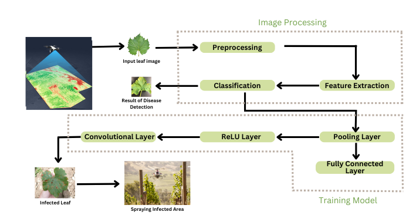

# Drone-Based Crop Disease Detection and Targeted Spraying for Precision Agriculture🚁🌱

## 📌 Overview  
This project leverages drone technology and machine learning, particularly Convolutional Neural Networks (CNNs), to detect and analyze crop diseases and pests, providing precise insights for optimized agricultural productivity. By integrating advanced image processing techniques and a robust CNN-based model, the system enables early and accurate identification of crop health issues, minimizing losses and enhancing resource utilization.

## 🔥 Key Features  
### - Convolutional Neural Network (CNN):  
- Developed a custom CNN architecture optimized for image classification and feature extraction.  
- Layers include convolutional layers for feature detection, pooling layers for dimensionality reduction, and fully connected layers for classification.  
- Applied techniques such as data augmentation, dropout, and batch normalization to improve model accuracy and generalization.  

#### CNN Architecture  
- **Input Layer**: Accepts preprocessed drone-captured images (e.g., 224x224 RGB).  
- **Convolutional Layers**: Extract hierarchical features such as edges, textures, and shapes using multiple filters.  
- **Pooling Layers**: Perform max-pooling to reduce spatial dimensions while preserving essential features.  
- **Fully Connected Layers**: Process extracted features to output probabilities for disease and pest categories.  
- **Activation Functions**: Used ReLU in hidden layers and Softmax for the output layer.  
- **Optimization**: Trained using Adam optimizer and cross-entropy loss function.  

### - Machine Learning Models:  
Built and compared models using TensorFlow to achieve high accuracy in disease and pest detection.  

### - Image Processing:  
Preprocessed drone-captured images for noise reduction, feature extraction, and segmentation.  

### - Geospatial Mapping:  
Integrated GPS data to map disease occurrences and visualize affected areas.  

### - Targeted Spraying System:  
Developed an automated pesticide spraying system that precisely targets affected crops, minimizing chemical overuse and improving efficiency.  

### - Real-Time Monitoring & Dashboard:  
Implemented a web-based dashboard to visualize crop health data, alert farmers to disease outbreaks, and provide decision support.  

## 🏗️ Architecture  
  

The diagram illustrates the workflow for detecting crop diseases using drones and a CNN-based machine learning model. It consists of two main stages:  

### Image Processing:  
- Drones capture images of crops.  
- These images undergo preprocessing to enhance quality.  
- Feature extraction identifies patterns in the images, which are then classified to detect diseases.  

### Training Model:  
- The Convolutional Neural Network (CNN) processes the input images.  
- **Convolutional Layers**: Extract features like edges and textures.  
- **ReLU Layers**: Introduce non-linearity.  
- **Pooling Layers**: Reduce dimensions while retaining key features.  
- **Fully Connected Layers**: Generate classification results.  
- Finally, the identified disease areas can be targeted for spraying infected crops, providing a complete solution for agricultural disease management.  

## 🛠️ Tools & Technologies  
### - Python Libraries:  
TensorFlow, Pandas, NumPy, Matplotlib, OpenCV  
### - Drone Navigation:  
Mission Planner, AeroGCS Green  
### - Data Handling:  
Image preprocessing and geospatial analysis  
### - Web Development:  
React.js (for dashboard), Flask/Django (for backend API)  
### - Database:  
PostgreSQL / Firebase for storing analysis results and user interactions  

## 🚀 Installation & Setup  
1. Clone the repository:  
   ```bash  
   git clone https://github.com/your-repo-name.git  
   cd your-repo-name  
   ```  
2. Install dependencies:  
   ```bash  
   pip install -r requirements.txt  
   ```  
3. Run the application:  
   ```bash  
   python app.py  
   ```  
4. Ensure drone integration and database setup before execution.  

## 🏃 Usage Instructions  
1. Deploy the drone and capture images of the field.  
2. Upload images to the system for preprocessing.  
3. View the disease detection results via the web-based dashboard.  
4. Activate the targeted spraying system if disease is detected.  

## 📊 Dataset Information  
- **Source**: Custom-collected drone images and publicly available datasets.  
- **Preprocessing**: Noise reduction, feature extraction, and segmentation techniques applied.  

## 📈 Evaluation Metrics  
- Accuracy  
- Precision  
- Recall  
- F1-score  

## 🔮 Future Enhancements  
- **Integration with IoT sensors** for real-time environmental monitoring.  
- **Advanced deep learning models** for improved accuracy.  
- **Mobile application** for on-the-go disease detection.  
- **Autonomous drone flight** with AI-based navigation.  

## 🏆 Achievements  
### - Aavishkar and SNJB Ideation:  
Recognized for its innovative and practical application.  
### - Precision Agriculture Research Recognition:  
Acknowledged for its contribution to AI-driven agricultural advancements.  

## 🌍 Impact  
This project bridges the gap between technology and agriculture, showcasing the potential of drone-based machine learning solutions in addressing real-world challenges. It improves crop yield, reduces costs, and minimizes environmental impact through precise pesticide application.  

## 🤝 Contributors  
- **Tejashree Arun Khadangale** (Project Lead)  
- Dhanashri Bhoyate  
- Vaishanavi Kotwal  
- Madhuri Chavhan  

## 📜 License  
This project is licensed under the MIT License.  

---  

🌱 *Empowering Precision Agriculture with AI & Drones* 🚁  
